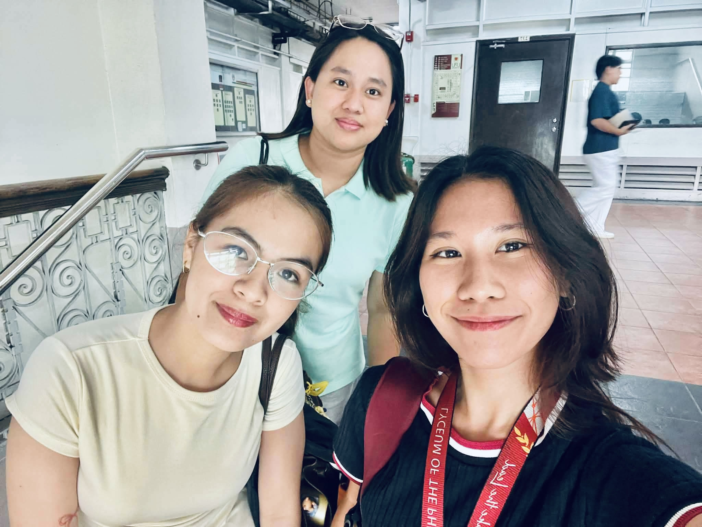

<html lang="en">
<head>
<meta charset="UTF-8">
<meta name="viewport" content="width=device-width, initial-scale=1.0">
<title>Judy Ann Maranan | Coquette Portfolio</title>
<link href="https://fonts.googleapis.com/css2?family=Poppins:wght@300;400;500;600&family=Playfair+Display:wght@600;700&display=swap" rel="stylesheet">

</head>
<body>

<nav>

Judy Ann ♡

<ul>
<li><a href="#about">About</a></li>
<li><a href="#education">Education</a></li>
<li><a href="#family">Family</a></li>
<li><a href="#interests">Interests</a></li>
<li><a href="#gallery">Gallery</a></li>
<li><a href="#advocacy">Advocacy</a></li>
<li><a href="#contact">Contact</a></li>
</ul>
</nav>

<h1>Judy Ann B. Maranan</h1>

Dreamer • Fur Mom • Coffee Lover

<section id="about">
<h2>🌷 About Me</h2>

<b>Full Name:</b> Judy Ann B. Maranan

<b>Age:</b> 28 Years Old

<b>Birthday:</b> April 09, 1998

<b>Favorite Color:</b> Pink

<b>Address:</b> Cainta, Rizal

Hi! I am Judy Ann Maranan. I am a college student who loves learning new things, spending time with family, friends, and especially with my dogs while exploring creative ideas.

My dream is to become successful and inspire others through hard work and kindness.

</section>
<section id="education">
<h2>🎓 Educational Background</h2>

<h3>Grade School</h3>

I studied at Urdaneta Elementary School where I learned the importance of education, discipline, and friendship.

<h3>High School</h3>

I studied at Bendita National High School where I discovered my strengths and built my confidence.

<h3>College</h3>

I studied BS Accountancy at AMA University Quezon City. I am currently studying Customs Administration at LPU Manila.

</section>
<section>
<h2>🏆 Achievements</h2>

Passed the NCIII Bookkeeping in 2018

Passed the IC3 Assessment

</section>
<section id="family">
<h2>👨‍👩‍👧‍👦 Family Background</h2>

My father is my role model and my source of strength. His hard work, sacrifices, and unwavering support inspire me to face life's challenges with courage and determination.

My mother is the heart of our family. Her endless love, care, and encouragement make every day brighter.

My siblings are my lifelong friends and partners in every adventure.

My fur babies hold a special place in my heart. They are not just pets — they are family. ❤️🐶

</section>
<section id="interests">
<h2>💖 Interests & Hobbies</h2>

<h3>Snoopy Things 🐶</h3>

I enjoy collecting Snoopy-themed items because they bring comfort and happiness.

<h3>Baking 🧁</h3>

Baking allows me to express creativity and share happiness through desserts.

<h3>Business 💼</h3>

Learning entrepreneurship inspires me to turn ideas into opportunities.

<h3>PBA Basketball 🏀</h3>

I enjoy watching exciting basketball games and supporting my favorite teams.

<h3>Playing with My Dogs 🐾</h3>

My dogs bring joy, comfort, and unconditional love into my life.

<h3>Friends 🤍</h3>

My friends make life more meaningful through laughter and support.

</section>
<section id="gallery">
<h2>📸 Gallery</h2>

</section>
<section>
<h2>🎥 My Video</h2>
<video controls>
<source src="copy_C29606BD-9360-4C6D-BDE7-033D2994FC18.mp4" type="video/mp4">
</video>
</section>
<section id="advocacy">
<h2>💚 Mental Health Awareness</h2>

Mental health awareness is an advocacy that is close to my heart. I believe everyone deserves to be heard, understood, and supported.

<blockquote>
"When the time is right, I, the Lord, will make it happen." — Isaiah 60:22
</blockquote>
</section>
<section id="contact">
<h2>📩 Contact Me</h2>

Email: jmaranan0409@yahoo.com

<a href="https://www.facebook.com/share/1KPvi4ufrd/?mibextid=wwXIfr" target="_blank">
Facebook
</a>
<a href="https://www.instagram.com/nphabmi_09" target="_blank">
Instagram
</a>

</section>
<footer>
Made with ♡ by Judy Ann Maranan 🌷🩷🩵
</footer>

</body>
